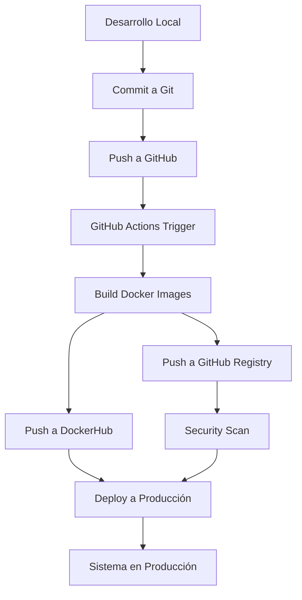

# 🏗️ **ESTRUCTURA COMPLETA DE LA PLATAFORMA CONTROLACCESO**

## 📋 **RESUMEN EJECUTIVO**

La plataforma ControlAcceso es un sistema integral de gestión de acceso que consta de tres componentes principales: Frontend (React), Backend (Node.js/Express), y Base de Datos (PostgreSQL), con procesos automatizados de deployment a GitHub, Docker y DockerHub.

---

## 🏛️ **ARQUITECTURA GENERAL**

```
ControlAcceso/
├── 🌐 FRONTEND (React + Material-UI)
├── ⚙️  BACKEND (Node.js + Express + Sequelize)
├── 🗄️  DATABASE (PostgreSQL)
├── 🐳 DOCKER (Containerización)
├── 🚀 DEPLOYMENT (GitHub Actions + DockerHub)
└── 📚 DOCUMENTACIÓN
```

---

## 🌐 **FRONTEND - ESTRUCTURA Y PROCESOS**

### **📁 Estructura de Archivos**
```
frontend/
├── 📦 package.json                    # Dependencias y scripts
├── 🐳 Dockerfile                      # Imagen Docker para producción
├── 🌐 nginx.conf                      # Configuración Nginx
├── 📁 public/                         # Archivos estáticos
│   ├── index.html                     # Punto de entrada HTML
│   ├── simple-test.html               # Página de pruebas
│   ├── test-config.html               # Configuración de pruebas
│   └── test-login.html                # Login de pruebas
├── 📁 src/                           # Código fuente React
│   ├── 🎯 index.js                    # Punto de entrada React
│   ├── 🎨 App.js                      # Componente principal
│   ├── 🎨 App.css                     # Estilos principales
│   ├── 🎨 index.css                   # Estilos globales
│   ├── 📁 components/                 # Componentes React
│   │   ├── 🏠 Layout.js               # Layout principal
│   │   ├── 🔐 Login.js                # Componente de login
│   │   ├── 🛡️ ProtectedRoute.js       # Rutas protegidas
│   │   ├── 📊 Dashboard.js            # Dashboard principal
│   │   ├── 📁 bitacora/               # Módulo de bitácora
│   │   │   └── Bitacora.js
│   │   ├── 📁 enrolamiento/           # Módulo de enrolamiento
│   │   │   └── Enrolamiento.js
│   │   ├── 📁 propietarios/           # Módulo de propietarios
│   │   │   └── Propietarios.js
│   │   ├── 📁 residente/              # Módulo de residentes
│   │   │   └── Residente.js
│   │   ├── 📁 usuarios/               # Módulo de usuarios
│   │   │   ├── Usuarios.js
│   │   │   └── TestAPI.js
│   │   ├── 📁 Visita_Externa/         # Módulo de visitas externas
│   │   │   └── VisitaExterna.js
│   │   └── 📁 visitas/                # Módulo de visitas
│   │       └── Visitas.js
│   ├── 📁 config/                     # Configuración
│   │   └── config.js                  # Configuración de la app
│   ├── 📁 contexts/                   # Contextos React
│   │   └── AuthContext.js             # Contexto de autenticación
│   └── 📁 utils/                      # Utilidades
│       ├── api.js                     # Cliente API
│       └── audit.js                   # Utilidades de auditoría
└── 📁 build/                         # Build de producción
    ├── index.html
    ├── asset-manifest.json
    └── static/                        # Archivos estáticos compilados
```

### **⚙️ Procesos de Funcionamiento Frontend**

#### **1. Inicialización**
- **Archivo**: `src/index.js`
- **Proceso**: 
  ```javascript
  ReactDOM.render(<App />, document.getElementById('root'))
  ```

#### **2. Configuración de Rutas**
- **Archivo**: `src/App.js`
- **Proceso**: Configuración de React Router y rutas protegidas

#### **3. Autenticación**
- **Archivo**: `src/contexts/AuthContext.js`
- **Proceso**: Manejo global del estado de autenticación

#### **4. Comunicación con Backend**
- **Archivo**: `src/utils/api.js`
- **Proceso**: Cliente HTTP con interceptores para tokens

#### **5. Componentes Principales**
- **Dashboard**: `src/components/Dashboard.js` - Muestra estadísticas en tiempo real
- **Login**: `src/components/Login.js` - Autenticación de usuarios
- **Layout**: `src/components/Layout.js` - Estructura común de páginas

### **🚀 Build y Deployment Frontend**

#### **Desarrollo**
```bash
npm start          # Servidor de desarrollo en puerto 3000
```

#### **Producción**
```bash
npm run build      # Genera build optimizado en /build
```

#### **Docker**
```dockerfile
# Multi-stage build
FROM node:18-alpine AS dependencies
FROM node:18-alpine AS build
FROM nginx:1.25-alpine AS production
```

---

## ⚙️ **BACKEND - ESTRUCTURA Y PROCESOS**

### **📁 Estructura de Archivos**
```
backend/
├── 📦 package.json                    # Dependencias y scripts
├── 🐳 Dockerfile                      # Imagen Docker para producción
├── 📁 src/                           # Código fuente Node.js
│   ├── 🚀 index.js                    # Servidor principal
│   ├── 🚀 index-simple.js             # Servidor simplificado
│   ├── 📁 config/                     # Configuración
│   │   └── database.js                # Configuración de BD
│   ├── 📁 controllers/                # Controladores (Lógica de negocio)
│   │   ├── accessController.js        # Control de accesos
│   │   ├── authController.js          # Autenticación
│   │   ├── bitacoraController.js      # Bitácora/auditoría
│   │   ├── personaController.js       # Gestión de personas
│   │   ├── residenteController.js     # Gestión de residentes
│   │   ├── userController.js          # Gestión de usuarios
│   │   ├── visitaController.js        # Gestión de visitas
│   │   └── visitaExternaController.js # Gestión de visitas externas
│   ├── 📁 middleware/                 # Middleware personalizado
│   │   ├── audit.js                   # Middleware de auditoría
│   │   └── auth.js                    # Middleware de autenticación
│   ├── 📁 models/                     # Modelos de datos (Sequelize)
│   │   ├── index.js                   # Configuración de modelos
│   │   ├── AccessLog.js               # Logs de acceso
│   │   ├── AccessPermission.js        # Permisos de acceso
│   │   ├── Area.js                    # Áreas del sistema
│   │   ├── Audit.js                   # Auditoría
│   │   ├── Device.js                  # Dispositivos
│   │   ├── Profile.js                 # Perfiles de usuario
│   │   ├── Residente.js               # Residentes
│   │   ├── Role.js                    # Roles de usuario
│   │   ├── Session.js                 # Sesiones
│   │   ├── SystemConfig.js            # Configuración del sistema
│   │   ├── User.js                    # Usuarios
│   │   ├── Visita.js                  # Visitas
│   │   └── VisitaExterna.js           # Visitas externas
│   ├── 📁 routes/                     # Rutas de la API
│   │   ├── access.js                  # Rutas de acceso
│   │   ├── auth.js                    # Rutas de autenticación
│   │   ├── bitacora.js                # Rutas de bitácora
│   │   ├── enrolamiento.js            # Rutas de enrolamiento
│   │   ├── residentes.js              # Rutas de residentes
│   │   ├── users.js                   # Rutas de usuarios
│   │   ├── visitas.js                 # Rutas de visitas
│   │   └── visitasExternas.js         # Rutas de visitas externas
│   └── 📁 seeds/                      # Datos de prueba
│       ├── accessLogData.js           # Datos de logs de acceso
│       ├── initialData.js             # Datos iniciales
│       └── simpleAccessData.js        # Datos simples de acceso
├── 📁 scripts/                        # Scripts utilitarios
│   ├── cleanup-duplicate-audit-events.js
│   └── insert-test-audit-events.js
└── 📁 tests/                          # Tests unitarios
```

### **⚙️ Procesos de Funcionamiento Backend**

#### **1. Inicialización del Servidor**
- **Archivo**: `src/index.js`
- **Proceso**:
  ```javascript
  const app = express()
  // Configuración de middleware
  // Configuración de rutas
  // Inicialización de base de datos
  app.listen(PORT)
  ```

#### **2. Configuración de Base de Datos**
- **Archivo**: `src/config/database.js`
- **Proceso**: Configuración de conexión Sequelize con PostgreSQL

#### **3. Middleware de Autenticación**
- **Archivo**: `src/middleware/auth.js`
- **Proceso**: Verificación de tokens JWT

#### **4. Middleware de Auditoría**
- **Archivo**: `src/middleware/audit.js`
- **Proceso**: Registro automático de eventos del sistema

#### **5. Controladores**
- **accessController.js**: Maneja estadísticas de acceso y mapas de calor
- **authController.js**: Maneja login, logout y gestión de sesiones
- **bitacoraController.js**: Maneja eventos de auditoría
- **residenteController.js**: CRUD de residentes
- **visitaController.js**: CRUD de visitas

#### **6. Modelos de Datos**
- **Sequelize ORM** para mapeo objeto-relacional
- **Validaciones** automáticas de datos
- **Relaciones** entre entidades

### **🚀 Build y Deployment Backend**

#### **Desarrollo**
```bash
npm run dev          # Servidor con nodemon (auto-reload)
```

#### **Producción**
```bash
npm start            # Servidor de producción
```

#### **Docker**
```dockerfile
# Multi-stage build
FROM node:18-alpine AS dependencies
FROM node:18-alpine AS build
FROM node:18-alpine AS production
```

---

## 🗄️ **BASE DE DATOS - ESTRUCTURA Y PROCESOS**

### **📁 Estructura de Archivos**
```
database/
├── 🐳 Dockerfile                      # Imagen Docker PostgreSQL
├── 📦 package.json                    # Dependencias Node.js
├── 📋 schema.sql                      # Esquema principal de BD
├── 📋 simple-schema.sql               # Esquema simplificado
├── 📋 postgresql.conf                 # Configuración PostgreSQL
├── 🚀 init-db.js                      # Script de inicialización
├── 🚀 init-simple.js                  # Script de inicialización simple
├── 🚀 setup-postgres.js               # Configuración de PostgreSQL
├── 🚀 generate-admin-password.js      # Generación de contraseñas
├── 📁 migrations/                     # Migraciones de BD
│   ├── add_auditoria_table.sql        # Tabla de auditoría
│   ├── add_personas_table.sql         # Tabla de personas
│   ├── add_residentes_table.sql       # Tabla de residentes
│   ├── add_tipo_documento_to_visitas.sql
│   └── add_tipo_documento_to_visitas_simple.sql
├── 📁 seeds/                          # Datos de prueba
├── 📋 insert-test-visitas.sql         # Datos de prueba de visitas
├── 📋 insert-visitas-ejemplo.sql      # Ejemplos de visitas
├── 📋 ESTADO_ACTUAL.md                # Estado actual de la BD
└── 📋 README.md                       # Documentación de BD
```

### **⚙️ Procesos de Funcionamiento Base de Datos**

#### **1. Inicialización**
- **Archivo**: `init-db.js`
- **Proceso**: Creación de tablas y datos iniciales

#### **2. Esquema Principal**
- **Archivo**: `schema.sql`
- **Tablas principales**:
  - `usuarios` - Usuarios del sistema
  - `residentes` - Residentes registrados
  - `visitas` - Registro de visitas
  - `visitas_externas` - Visitas externas
  - `access_logs` - Logs de acceso
  - `auditoria` - Eventos de auditoría
  - `areas` - Áreas del sistema
  - `dispositivos` - Dispositivos de control

#### **3. Migraciones**
- **Archivo**: `migrations/*.sql`
- **Proceso**: Actualizaciones incrementales del esquema

#### **4. Configuración PostgreSQL**
- **Archivo**: `postgresql.conf`
- **Configuraciones**: Rendimiento, seguridad, logging

### **🚀 Build y Deployment Base de Datos**

#### **Docker**
```dockerfile
FROM postgres:15-alpine
COPY schema.sql /docker-entrypoint-initdb.d/
COPY init-db.js /docker-entrypoint-initdb.d/
```

#### **Inicialización**
```bash
# Datos persistentes en volumen Docker
postgres_data:/var/lib/postgresql/data
```

---

## 🐳 **DOCKER - ESTRUCTURA Y PROCESOS**

### **📁 Archivos de Configuración**
```
├── 🐳 docker-compose.yml              # Configuración principal
├── 🐳 docker-compose.prod.yml         # Configuración producción
├── 🐳 docker-compose.hub.yml          # Configuración DockerHub
├── 🌐 nginx/                          # Configuración Nginx
│   └── nginx.prod.conf                # Configuración producción
└── 📋 .dockerignore                   # Archivos ignorados en Docker
```

### **⚙️ Procesos de Docker**

#### **1. Servicios Definidos**
```yaml
services:
  database:     # PostgreSQL
  backend:      # Node.js API
  frontend:     # React + Nginx
```

#### **2. Redes**
```yaml
networks:
  controlacceso-network:
    driver: bridge
    ipam:
      config:
        - subnet: 172.20.0.0/16
```

#### **3. Volúmenes**
```yaml
volumes:
  postgres_data:     # Datos persistentes PostgreSQL
  backend_logs:      # Logs del backend
  backend_uploads:   # Archivos subidos
```

#### **4. Health Checks**
```yaml
healthcheck:
  test: ["CMD-SHELL", "pg_isready -U postgres"]
  interval: 10s
  timeout: 5s
  retries: 5
```

---

## 🚀 **DEPLOYMENT - PROCESOS AUTOMATIZADOS**

### **📁 Estructura de Scripts**
```
scripts/
├── 🚀 deploy.sh                       # Script principal de deployment
├── 🚀 build.sh                        # Script de construcción
├── 🚀 dockerhub.sh                    # Script de DockerHub
├── 🚀 setup-github.sh                 # Configuración GitHub
├── 🚀 auto-setup-github.sh            # Setup automático GitHub
├── 🚀 complete-auto-setup.sh          # Setup completo automático
├── 🚀 version-manager.sh              # Gestión de versiones
└── 🚀 bypass-xcode-setup.sh           # Bypass para Xcode
```

### **📁 GitHub Actions**
```
.github/workflows/
├── 🚀 docker-build.yml                # Build y push a GitHub Registry
├── 🚀 dockerhub-push.yml              # Push a DockerHub
└── 🚀 version-manager.yml             # Gestión automática de versiones
```

---

## 🔄 **PROCESOS DE DEPLOYMENT**

### **1. 🐙 DEPLOYMENT A GITHUB**

#### **Proceso Automático (GitHub Actions)**
```yaml
# Trigger: Push a main/develop o tags v*
on:
  push:
    branches: [ main, develop ]
    tags: [ 'v*' ]
```

#### **Flujo de Trabajo**:
1. **Checkout** del código
2. **Setup Docker Buildx**
3. **Login** a GitHub Container Registry
4. **Build** de imágenes Docker
5. **Push** a GitHub Registry
6. **Security Scan** con Trivy
7. **Deploy** a staging/production

#### **Archivos Involucrados**:
- `.github/workflows/docker-build.yml`
- `.github/workflows/version-manager.yml`
- `VERSION` (archivo de versiones)

### **2. 🐳 DEPLOYMENT A DOCKER**

#### **Proceso Manual**
```bash
# Construcción de imágenes
docker-compose build

# Ejecución de servicios
docker-compose up -d

# Verificación de estado
docker-compose ps
```

#### **Proceso Automatizado**
```bash
# Script de deployment
./scripts/deploy.sh production deploy
```

#### **Archivos Involucrados**:
- `docker-compose.yml`
- `docker-compose.prod.yml`
- `scripts/deploy.sh`
- `Dockerfile` (en cada servicio)

### **3. 🌊 DEPLOYMENT A DOCKERHUB**

#### **Proceso Automático (GitHub Actions)**
```yaml
# Trigger: Push a main o tags v*
on:
  push:
    branches: [ main ]
    tags: [ 'v*' ]
```

#### **Flujo de Trabajo**:
1. **Checkout** del código
2. **Setup Docker Buildx**
3. **Login** a DockerHub
4. **Build** de imágenes (backend, frontend, database)
5. **Push** a DockerHub con versionado
6. **Generación** de docker-compose para producción

#### **Archivos Involucrados**:
- `.github/workflows/dockerhub-push.yml`
- `VERSION` (archivo de versiones)
- `Dockerfile` (en cada servicio)

#### **Imágenes Generadas**:
```
fescobarmo/controlacceso-backend:latest
fescobarmo/controlacceso-frontend:latest
fescobarmo/controlacceso-database:latest
```

---

## 🔧 **CONFIGURACIÓN DE VARIABLES**

### **📁 Archivos de Configuración**
```
├── 📋 env.example                     # Variables de entorno ejemplo
├── 📋 .env                           # Variables de entorno (local)
├── 📋 VERSION                        # Versiones del sistema
└── 📋 .gitignore                     # Archivos ignorados
```

### **🔑 Variables Importantes**
```env
# Base de Datos
DB_NAME=controlacceso
DB_USER=postgres
DB_PASSWORD=postgres123
DB_PORT=5432

# Backend
NODE_ENV=production
PORT=3001
JWT_SECRET=your-super-secret-jwt-key

# Frontend
REACT_APP_API_URL=http://localhost:3001
REACT_APP_BACKEND_URL=http://localhost:3001

# Docker Hub
DOCKERHUB_USERNAME=fescobarmo
DOCKERHUB_REPOSITORY=controlacceso
```

---

## 📊 **FLUJO COMPLETO DE DEPLOYMENT**

### **🔄 Flujo de Desarrollo a Producción**



### **📋 Comandos de Deployment**

#### **Desarrollo Local**
```bash
# Iniciar desarrollo
npm run dev          # Backend
npm start            # Frontend

# Docker local
docker-compose up -d
```

#### **Producción Manual**
```bash
# Deploy completo
./scripts/deploy.sh production deploy

# Deploy con push a DockerHub
./scripts/deploy.sh production push

# Deploy rápido
./scripts/deploy.sh production quick
```

#### **Producción Automática**
```bash
# Git push (activa GitHub Actions)
git push origin main

# Tag release (activa deployment)
git tag v1.0.0
git push origin v1.0.0
```

---

## 🔍 **MONITOREO Y HEALTH CHECKS**

### **🏥 Health Checks Configurados**

#### **Base de Datos**
```bash
pg_isready -U postgres -d controlacceso
```

#### **Backend**
```bash
curl -f http://localhost:3001/health
```

#### **Frontend**
```bash
curl -f http://localhost/health
```

### **📊 URLs de Acceso**

#### **Desarrollo**
- Frontend: http://localhost:3000
- Backend: http://localhost:3001
- Database: localhost:5432

#### **Producción**
- Frontend: Puerto configurado en FRONTEND_PORT
- Backend: Puerto configurado en BACKEND_PORT
- Database: Puerto configurado en DB_PORT

---

## 🛡️ **SEGURIDAD Y MEJORES PRÁCTICAS**

### **🔐 Seguridad Implementada**

1. **Autenticación JWT** con tokens seguros
2. **Middleware de auditoría** para todos los eventos
3. **Validación de entrada** con express-validator
4. **Helmet** para headers de seguridad
5. **CORS** configurado apropiadamente
6. **Health checks** para monitoreo
7. **Security scanning** con Trivy

### **📋 Mejores Prácticas**

1. **Multi-stage Docker builds** para optimización
2. **Non-root users** en contenedores
3. **Secrets management** con variables de entorno
4. **Automated testing** en CI/CD
5. **Versioning** automático
6. **Rollback capabilities** con tags

---

## 📈 **ESCALABILIDAD Y RENDIMIENTO**

### **⚡ Optimizaciones Implementadas**

1. **Connection pooling** en PostgreSQL
2. **Nginx** para servir archivos estáticos
3. **Docker multi-platform** builds
4. **Caching** en GitHub Actions
5. **Optimized Docker images** con Alpine Linux
6. **Health checks** para load balancing

### **📊 Métricas de Rendimiento**

- **Tiempo de build**: ~5-10 minutos
- **Tamaño de imágenes**: 
  - Frontend: ~50MB
  - Backend: ~200MB
  - Database: ~150MB
- **Tiempo de startup**: ~30-60 segundos

---

## 🎯 **CONCLUSIÓN**

La plataforma ControlAcceso implementa una arquitectura moderna y escalable con:

- ✅ **Separación clara** de responsabilidades
- ✅ **Containerización completa** con Docker
- ✅ **CI/CD automatizado** con GitHub Actions
- ✅ **Deployment multi-plataforma** (GitHub, Docker, DockerHub)
- ✅ **Monitoreo y health checks** integrados
- ✅ **Seguridad** implementada en todas las capas
- ✅ **Escalabilidad** preparada para producción

El sistema está diseñado para ser robusto, mantenible y fácil de desplegar en cualquier entorno.


