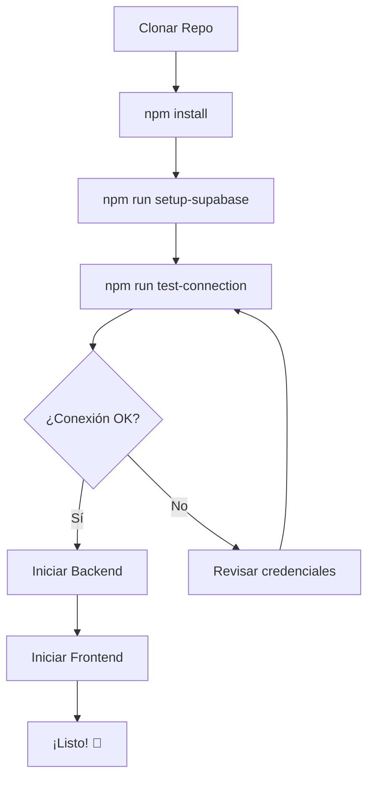

# 🎯 Resumen: Setup de Supabase Completado

## ✅ ¿Qué se ha creado?

Se ha configurado completamente tu aplicación **ControlAcceso** para funcionar con **Supabase**. A continuación, el resumen de todos los archivos creados y su propósito:

---

## 📁 Estructura de Archivos Nuevos

```
ControlAcceso/
│
├── 📖 GUIA_SUPABASE.md                    ← Guía completa y detallada
├── 📖 INICIO_RAPIDO_SUPABASE.md           ← Inicio rápido (15 min)
├── 📖 ARQUITECTURA_SUPABASE.md            ← Diagramas y arquitectura
├── 📖 SUPABASE_SETUP_COMPLETO.md          ← Referencia completa
├── 📖 RESUMEN_SUPABASE.md                 ← Este archivo
│
├── 📦 package.json                         ← Actualizado con scripts
│
├── 📄 README.md                            ← Actualizado (Opción Supabase)
│
└── scripts/
    ├── 🔧 setup-supabase.sh               ← Configuración interactiva
    ├── 🧪 test-supabase-connection.js     ← Test de conexión
    └── 🔄 migrate-to-supabase.sh          ← Migración automatizada
```

---

## 🚀 Comandos Rápidos

### Setup Inicial (Primera vez)

```bash
# 1. Configurar todo (interactivo)
npm run setup-supabase

# 2. Verificar que funciona
npm run test-connection

# 3. Iniciar backend
cd backend && npm install && npm start

# 4. Iniciar frontend (nueva terminal)
cd frontend && npm install && npm start
```

### Uso Diario

```bash
# Backend
cd backend && npm start

# Frontend (nueva terminal)
cd frontend && npm start

# Abrir: http://localhost:3000
```

---

## 📖 Guías Disponibles

| Archivo | Contenido | Cuándo Usarlo |
|---------|-----------|---------------|
| **INICIO_RAPIDO_SUPABASE.md** | Guía rápida de 15 min | Primera vez, quieres empezar YA |
| **GUIA_SUPABASE.md** | Guía completa y detallada | Necesitas entender todo el proceso |
| **ARQUITECTURA_SUPABASE.md** | Diagramas y arquitectura | Entender cómo funciona el sistema |
| **SUPABASE_SETUP_COMPLETO.md** | Referencia completa | Consulta rápida de todo |
| **RESUMEN_SUPABASE.md** | Este resumen | Vista general rápida |

---

## 🛠️ Scripts Disponibles

### 1. Setup Interactivo
```bash
npm run setup-supabase
# O directamente:
./scripts/setup-supabase.sh
```
**¿Qué hace?**
- ✅ Te pide las credenciales de Supabase
- ✅ Genera archivos `.env` automáticamente
- ✅ Opcionalmente migra el schema
- ✅ Todo listo en 5 minutos

### 2. Test de Conexión
```bash
npm run test-connection
# O directamente:
node scripts/test-supabase-connection.js
```
**¿Qué hace?**
- ✅ Verifica conexión a Supabase
- ✅ Lista tablas existentes
- ✅ Muestra estadísticas
- ✅ Diagnóstico de errores

### 3. Migración Automática
```bash
npm run migrate
# O directamente:
./scripts/migrate-to-supabase.sh
```
**¿Qué hace?**
- ✅ Crea backup de seguridad
- ✅ Ejecuta schema.sql en Supabase
- ✅ Verifica que todo esté OK
- ✅ Opción de datos de prueba

---

## 🎯 Flujo Recomendado

### Para Desarrolladores Nuevos



### 1️⃣ Primera Configuración
```bash
# Instalar dependencias
npm install

# Configurar Supabase (interactivo)
npm run setup-supabase
```

### 2️⃣ Verificar Conexión
```bash
# Probar que todo funciona
npm run test-connection
```

### 3️⃣ Desarrollo Local
```bash
# Terminal 1: Backend
cd backend
npm install
npm start

# Terminal 2: Frontend
cd frontend
npm install
npm start
```

### 4️⃣ Desplegar a Producción
Lee: **GUIA_SUPABASE.md** → Sección "Despliegue a Producción"

---

## 🔑 Credenciales Necesarias

### Obtener de Supabase

1. Ve a [app.supabase.com](https://app.supabase.com)
2. Selecciona tu proyecto
3. Settings → Database

Necesitas:
```
DB_HOST:     db.xxxxxxxxxxxx.supabase.co
DB_PASSWORD: [tu password]
```

### Generar Localmente

```bash
# JWT Secret (genera uno seguro)
openssl rand -base64 32
```

---

## 📊 Arquitectura de Despliegue

### Desarrollo Local
```
Localhost:3000     Localhost:3001      Supabase Cloud
┌────────────┐    ┌─────────────┐    ┌──────────────┐
│  Frontend  │───▶│   Backend   │───▶│  PostgreSQL  │
│   (React)  │    │  (Node.js)  │    │   Database   │
└────────────┘    └─────────────┘    └──────────────┘
```

### Producción
```
Vercel/Netlify       Railway/Render         Supabase
┌────────────┐      ┌─────────────┐      ┌──────────────┐
│  Frontend  │─────▶│   Backend   │─────▶│  PostgreSQL  │
│   (React)  │ HTTPS│  (Node.js)  │ SSL  │   Database   │
└────────────┘      └─────────────┘      └──────────────┘
    Public             Private               Managed
```

---

## ✅ Checklist de Verificación

### Antes de Empezar
- [ ] Node.js v18+ instalado
- [ ] npm instalado
- [ ] Git instalado
- [ ] Cuenta en Supabase creada

### Setup Inicial
- [ ] `npm install` ejecutado
- [ ] `npm run setup-supabase` completado
- [ ] Archivos `.env` creados en `backend/` y `frontend/`
- [ ] `npm run test-connection` exitoso

### Base de Datos
- [ ] Proyecto creado en Supabase
- [ ] Schema migrado (`npm run migrate`)
- [ ] Tablas visibles en Supabase Dashboard
- [ ] Usuario admin existe

### Aplicación Local
- [ ] Backend arranca sin errores
- [ ] Frontend arranca sin errores
- [ ] Login funciona
- [ ] Dashboard carga

### Producción (Opcional)
- [ ] Backend desplegado (Railway/Render/Fly.io)
- [ ] Frontend desplegado (Vercel/Netlify)
- [ ] Variables de entorno configuradas en producción
- [ ] SSL/HTTPS funcionando

---

## 🆘 Problemas Comunes y Soluciones

| Problema | Solución |
|----------|----------|
| **"Cannot connect to database"** | Verifica `DB_HOST` y `DB_PASSWORD` en `backend/.env` |
| **"No tables found"** | Ejecuta `npm run migrate` |
| **"CORS blocked"** | Verifica `FRONTEND_URL` en `backend/.env` |
| **"JWT malformed"** | Verifica `JWT_SECRET` en `backend/.env` |
| **"psql not found"** | Instala PostgreSQL client o usa Supabase SQL Editor |
| **Scripts no ejecutan** | Ejecuta `chmod +x scripts/*.sh` |

**Diagnóstico completo:**
```bash
node scripts/test-supabase-connection.js
```

---

## 📞 Siguientes Pasos

### Desarrollo
1. ✅ **Completa el setup** siguiendo [INICIO_RAPIDO_SUPABASE.md](./INICIO_RAPIDO_SUPABASE.md)
2. 🧪 **Prueba la aplicación** localmente
3. 🔐 **Cambia credenciales por defecto**
4. 📝 **Personaliza según tus necesidades**

### Producción
1. 🚀 **Despliega backend** en Railway/Render
2. 🎨 **Despliega frontend** en Vercel/Netlify
3. 🔒 **Configura SSL/HTTPS**
4. 📊 **Implementa monitoreo**
5. 🔐 **Configura backups**

### Aprendizaje
- 📖 Lee [ARQUITECTURA_SUPABASE.md](./ARQUITECTURA_SUPABASE.md) para entender el sistema
- 🔍 Explora el código en `backend/` y `frontend/`
- 🧪 Experimenta con Supabase Dashboard

---

## 🎉 ¡Felicidades!

Tu proyecto está completamente configurado para funcionar con Supabase. 

**¿Qué puedes hacer ahora?**

```bash
# Opción 1: Empezar rápido (15 min)
cat INICIO_RAPIDO_SUPABASE.md

# Opción 2: Entender todo (30 min)
cat GUIA_SUPABASE.md

# Opción 3: Configurar ahora mismo (5 min)
npm run setup-supabase
```

---

## 📚 Referencias

| Documento | Descripción |
|-----------|-------------|
| [INICIO_RAPIDO_SUPABASE.md](./INICIO_RAPIDO_SUPABASE.md) | Setup en 15 minutos |
| [GUIA_SUPABASE.md](./GUIA_SUPABASE.md) | Guía completa |
| [ARQUITECTURA_SUPABASE.md](./ARQUITECTURA_SUPABASE.md) | Diagramas y arquitectura |
| [SUPABASE_SETUP_COMPLETO.md](./SUPABASE_SETUP_COMPLETO.md) | Referencia completa |

### Enlaces Externos
- 🌐 [Supabase](https://supabase.com)
- 📖 [Supabase Docs](https://supabase.com/docs)
- 🚂 [Railway](https://railway.app)
- ▲ [Vercel](https://vercel.com)

---

**Desarrollado con ❤️ para facilitar el despliegue en Supabase**

**¿Preguntas?** Consulta la documentación o los scripts de diagnóstico.

---

*Última actualización: 2025-10-04*

